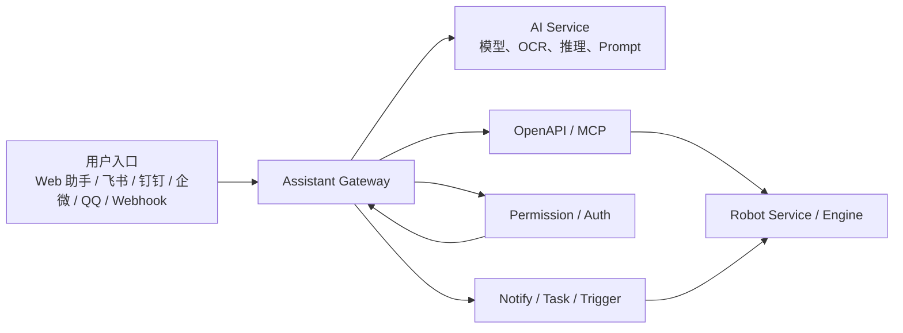

# OpenClaw 能力迁移与 Astron RPA 智能助手扩展方案

## 1. 文档目的

本文基于对 `../openclaw` 与当前 `astron-rpa` 源码的对照梳理，回答三个问题：

1. OpenClaw 里有哪些“值得迁移或透出”的配置项、能力和架构思路。
2. 这些能力落到 Astron RPA 时，最合适的承接点在哪里。
3. 面向国内四类主流 IM（钉钉、飞书、QQ、企微）时，Astron RPA 应该如何设计接入方案。

本文只做方案分析，不建议直接“照搬 OpenClaw”，而是尽量抽象出对 Astron RPA 真正有价值的部分。

---

## 2. 执行摘要

### 2.1 一句话结论

OpenClaw 最有价值的不是某个单点功能，而是一整套“本地代理网关 + 会话/事件流 + 插件/渠道适配 + 权限/审批 + 富交互回复”的控制面设计。Astron RPA 如果只把它当一个聊天框来接，收益会很有限；如果把其中的“控制面能力”抽出来，反而能把 RPA 从“流程执行平台”升级成“可对话、可审批、可接入 IM、可观测的自动化助手平台”。

### 2.2 最值得迁移的 8 类能力

1. 统一助手网关与事件流模型
2. 工具调用过程可视化与会话运行态管理
3. 方法级 scope 与审批控制
4. 插件化渠道适配器架构
5. 会话、渠道、用户、设备的统一身份映射
6. Webhook/Cron/通知的统一触发面
7. 富文本/卡片/流式回复能力
8. 每个租户、工作区、机器人可配置的助手身份与行为策略

### 2.3 最适合 Astron RPA 的落点

不建议把现有 `ai-service` 继续堆成“大而全智能服务”。更合理的职责划分是：

- `openapi-service` / MCP：暴露 RPA 能力给助手调用
- `robot-service`：真正执行流程、调度任务、记录结果、发通知
- `rpa-auth`：承接助手权限、scope、租户策略
- 前端助手页：承接会话、工具流、审批流和渠道状态
- 新增一个轻量的“assistant-gateway”层，统一会话、事件、渠道和审批

### 2.4 IM 侧的优先级建议

1. 飞书：最适合第一阶段落地
2. 企微：第二优先，企业场景价值高
3. 钉钉：第三优先，值得做，但要按企业应用思路单独设计
4. QQ：不建议作为企业级主通道，仅适合实验性或个人提醒

原因很简单：OpenClaw 现成已有飞书实现，且飞书的线程、卡片、机器人模式与“智能助手 + RPA 回调”天然契合；而钉钉、企微、QQ 在 OpenClaw 中目前并没有同等级的现成适配实现。

---

## 3. OpenClaw 源码侧能力地图

### 3.1 OpenClaw 的本质，不是聊天 UI，而是一个本地控制网关

从 `openclaw/README.md` 和 `src/gateway/*` 可以看出，OpenClaw 的核心不是单一对话模型，而是一个围绕本地代理运行的控制面：

- 对外有统一网关
- 对内管理工具、代理、渠道、会话、执行、审批、节点状态
- 前端 UI 只是这个控制面的一个消费者
- IM、语音、Web UI、Webhook、Cron 等都是“入口”

这对 Astron RPA 的启发很大。Astron RPA 当前更像“业务平台 + AI 点缀”，而 OpenClaw 更像“AI 控制面 + 多能力挂载”。如果 Astron RPA 后续想让助手真正驱动流程、审批、通知、渠道触达，就需要引入类似的控制面抽象。

### 3.2 OpenClaw 的配置面非常强，远超当前 Astron RPA 助手接入深度

OpenClaw 的 `src/config/types.gateway.ts`、`server-runtime-config.ts` 体现出非常完整的运行时配置面，核心包括：

- 网关绑定模式
  - `auto`
  - `lan`
  - `loopback`
  - `custom`
  - `tailnet`
- 认证模式
  - `none`
  - `token`
  - `password`
  - `trusted-proxy`
- 控制 UI 安全配置
  - `allowedOrigins`
  - `allowInsecureAuth`
  - `dangerouslyDisableDeviceAuth`
  - `basePath`
  - `root`
- 远程接入与隧道
  - `tailscale`
  - `remoteGateway.url`
  - `remoteGateway.token/password`
  - `sshTarget`
  - `tlsFingerprint`
- 运行时热更新策略
  - `off`
  - `restart`
  - `hot`
  - `hybrid`
- OpenAI 兼容 HTTP 入口
  - `chat completions`
  - `responses`
  - body/image/file 限制
- 渠道默认配置
  - 心跳是否可见
  - 默认 reply 行为

#### 对 Astron RPA 的启发

Astron RPA 当前的助手接入更像“前端连一个本地 WS 服务”，配置面相对薄。未来如果想支撑企业级落地，至少应该把以下配置透出来：

- 助手网关地址与模式
- 鉴权模式与 token/password/trusted proxy
- 允许的来源域
- 是否允许远程节点/跨端接入
- 文件上传/图片输入限制
- 默认工作区/租户/执行环境
- 渠道侧回调地址、签名、白名单与消息策略

换句话说，Astron RPA 需要的不只是“一个 openclawToken 输入框”，而是“助手控制面配置中心”。

### 3.3 OpenClaw 最关键的是事件流模型，而不是最终文本

`src/gateway/server-chat.ts`、`server-node-events.ts`、`server-methods-list.ts` 表明 OpenClaw 的交互是事件驱动的，而不是“请求一次、吐一段最终文本”：

- `agent` 事件
- `chat` 事件
- `presence` 事件
- `cron` 事件
- `exec.approval.requested`
- `exec.approval.resolved`
- device/node pair 事件

同时，聊天运行态本身也被建模：

- run registry
- buffer
- delta 节流
- abort
- tool-event recipient
- session state

#### 这意味着什么

OpenClaw 的真实优势不在“回答内容”，而在“过程可见”：

- 现在在做什么
- 调了哪个工具
- 工具成功还是失败
- 是否在等待审批
- 是否进入了子代理
- 是否切换到某个渠道

#### 对 Astron RPA 的迁移价值

Astron RPA 最应该迁移的是这套运行态思想。因为 RPA 的核心恰恰不是“对话内容”，而是“流程执行过程”。如果助手最终只能回一段文字，而不能暴露：

- 命中了哪个流程
- 调用了哪个 workflow / MCP tool
- 参数是什么
- 是否命中高风险动作
- 是否需要人工确认
- 进度怎样
- 结果落在哪里

那它很难真正成为企业助手，只能算一个问答入口。

### 3.4 OpenClaw 的权限模型比当前助手接入更成熟

`src/gateway/method-scopes.ts` 和 `auth-mode-policy.ts` 很关键。OpenClaw 不是简单区分“能连/不能连”，而是把方法级能力映射到 operator scope：

- `operator.admin`
- `operator.read`
- `operator.write`
- `operator.approvals`
- `operator.pairing`

不同 method 对应不同 scope，这种设计非常适合迁移到 Astron RPA。

#### 为什么适合 RPA

RPA 场景里“问流程”和“执行流程”根本不是一个风险等级：

- 查有哪些流程：低风险
- 查看执行记录：中风险
- 触发流程执行：高风险
- 修改调度：高风险
- 删除流程、覆盖版本、读写共享变量：更高风险

如果 Astron RPA 后续做 IM 接入或多人协作场景，scope 模型会比简单的“角色权限判断”更灵活。

#### 建议迁移的 scope 设计

可以在 Astron RPA 增加一层助手专用 scope，例如：

- `assistant.read`
  - 查询流程、版本、执行记录、状态
- `assistant.execute`
  - 触发流程、重跑、停止
- `assistant.task.write`
  - 创建/修改调度任务
- `assistant.resource.read`
  - 读取资源、变量、共享文件信息
- `assistant.resource.write`
  - 修改共享变量、上传资源
- `assistant.approval`
  - 审批高风险执行
- `assistant.channel.admin`
  - 配置 IM 渠道和白名单

这套 scope 再映射回 `rpa-auth` 的 entitlement/permission 体系，就可以与现有权限系统对齐。

### 3.5 OpenClaw 的审批机制特别适合 RPA 高风险动作

`src/gateway/exec-approval-manager.ts` 提供了审批请求、等待决策、单次放行等能力。这一层对 Astron RPA 的意义非常大。

RPA 不是纯问答系统，它会做真实业务动作：

- 运行某个流程
- 在终端上执行业务操作
- 访问共享文件
- 修改任务计划
- 发通知到外部系统

这些动作一旦由 AI 自动发起，就一定会遇到“需要人工确认”的问题。

#### 最值得直接迁移的审批场景

1. 首次执行某个流程
2. 跨部门或跨租户数据访问
3. 涉及批量发送、批量删除、批量修改
4. 修改调度、变量、凭据
5. 任何带副作用的“执行器实际动作”

#### 建议落到 Astron RPA 的方式

- 助手层提出执行意图
- 助手网关产生审批事件
- 前端、IM 或管理台都能审批
- `robot-service` 只在审批通过后真正执行

这会显著降低“AI 误触发流程”的风险。

### 3.6 OpenClaw 的插件/渠道架构，是最值得借鉴的长期资产

`src/gateway/server-plugins.ts` 展示的不是简单插件加载，而是一种“插件即能力适配器”的思想：

- 插件可以挂渠道
- 插件可以挂工具包
- 插件可以挂处理逻辑
- 插件共享网关 dispatch 与 subagent runtime

这个思路对 Astron RPA 特别重要。因为 RPA 后续想接：

- 各类 IM
- 邮件
- 企业审批流
- 自定义业务系统
- 内部知识库、表单、报表

如果每个都直接塞进 `robot-service` 或 `ai-service`，服务会越来越重，代码会越来越难控。

#### 更适合 Astron RPA 的做法

把 OpenClaw 的插件理念迁成 Astron RPA 里的三层：

1. `assistant-gateway`
   - 负责统一会话、事件、渠道、审批、tool 调度
2. `assistant-adapters`
   - 钉钉、飞书、企微、QQ、邮件、Webhook 等渠道适配
3. `assistant-tools`
   - 调用流程、查流程、查执行记录、读资源、发通知、跑报表等能力包

这样 Astron RPA 的增长方式会从“加功能”变成“加适配器和工具包”。

### 3.7 OpenClaw 的 assistant identity 能力值得迁移

`src/gateway/assistant-identity.ts` 支持助手身份配置，例如名称、头像、emoji、工作区身份。

这在 Astron RPA 看起来像“小功能”，其实很有产品价值。因为未来助手可能不是只有一个：

- 平台总助手
- 某个部门专属助手
- 某个流程域助手
- 某个租户专属助手
- 某个机器人或工作区助手

#### 建议透出的身份配置项

- 助手名称
- 头像/图标
- 展示描述
- 默认系统 prompt
- 可访问的工具包
- 默认工作区与默认流程域
- 是否允许主动通知
- 是否允许外部 IM 接入

这会把“AI 助手”从一个统一壳子，变成真正可运营的能力。

---

## 4. Astron RPA 当前能力盘点

### 4.1 Astron RPA 已经有三块很好的基础，但目前是分散的

从源码看，Astron RPA 并不是没有基础，反而基础很好，只是还没有被统一成“助手控制面”。

现有资产主要有三类：

1. 流程与执行资产
   - `robot-service`
   - `engine`
2. 对外暴露资产
   - `openapi-service`
   - MCP
3. 权限与租户资产
   - `rpa-auth`

这三者如果通过一个助手网关统一起来，就能形成完整闭环。

### 4.2 当前 `ai-service` 更像 AI 功能服务，不适合承担总控制面

`backend/ai-service` 当前能力更偏：

- chat completion 封装
- computer use
- smart component
- OCR / 验证码 / 点数等功能

这类服务适合做：

- 提示词编排
- 模型路由
- 生成式能力
- 视觉与 OCR 能力

但它并不天然适合承载：

- 渠道管理
- 会话事件流
- 审批流
- IM 适配
- 工具状态广播

#### 结论

后续如果继续把“助手网关”堆在 `ai-service` 上，会越来越别扭。更合理的是：

- `ai-service` 负责模型与智能处理
- `assistant-gateway` 负责会话和控制面
- `robot-service` 负责执行面

### 4.3 `openapi-service` 与 MCP 是目前最好的“能力暴露桥”

`backend/openapi-service` 已经提供了：

- workflow CRUD
- execution
- websocket
- API key
- `streamable_mcp.py`

而且当前已经有“把工作流暴露成 MCP tool”的设计。这一点非常关键，因为它说明 Astron RPA 已经天然具备“让 LLM 调流程”的能力基础。

#### 这意味着什么

很多 OpenClaw 的能力根本不用侵入 `robot-service` 才能先落地，可以先通过 `openapi-service + MCP` 完成：

- 助手查询流程列表
- 助手执行流程
- 助手查询执行记录
- 助手获取执行状态
- 助手通过工具 schema 暴露参数

#### 最佳实践建议

把 `openapi-service/MCP` 当成“助手工具层的标准出口”，这比直接让助手绕过服务访问数据库安全得多，也更容易审计。

### 4.4 `robot-service` 已经具备任务、触发、通知、监控等承接点

`robot-service` 当前模块结构非常适合承接助手动作：

- `robot`
- `task`
- `triggerTask`
- `notify`
- `monitor`
- `market`
- `component`

尤其值得注意的是：

- `task` 已经有调度语义
- `triggerTask` 已经有触发语义
- `notify` 已经有通知语义

也就是说，Astron RPA 并不需要从零造“助手能触发任务、助手能通知用户”这些能力，只是还没有把它们以“可对话、可审批、可外部触达”的方式统一封装起来。

### 4.5 `rpa-auth` 是承接助手权限、渠道身份映射的自然入口

`rpa-auth` 当前已经提供：

- 当前用户信息
- 权限信息
- entitlement
- 租户上下文

此外，源码里还能看到 Casdoor 用户模型里已经预留了：

- `qq`
- `dingtalk`
- `wecom`
- `lark`

这很值得注意。虽然目前这些字段还没有形成真正的 IM 接入能力，但它说明用户身份模型层已经意识到多 IM 身份映射的需求。

#### 结论

Astron RPA 后续做 IM 接入，不需要再额外造一套“外部 IM 用户身份库”，完全可以优先从 `rpa-auth` 用户维度扩展：

- IM 平台账号 ID
- unionId/openId/userId
- 企业 ID / 租户 ID
- 渠道绑定状态
- 白名单与配对关系

---

## 5. OpenClaw 能迁移到 Astron RPA 的能力清单

这一节按“迁移价值”而不是“源码模块名”来组织。

### 5.1 第一类：必须尽快迁移的控制面能力

#### 5.1.1 会话运行态与工具流事件

这是第一优先级。

应该让助手的每次会话至少暴露：

- 当前会话 ID
- 当前 run ID
- 当前命中的工具
- 工具开始/结束/失败
- 工具参数摘要
- 工具结果摘要
- 是否等待审批
- 是否已转人工
- 最终结果状态

#### 5.1.2 方法级权限与 scope

建议不要只做前端按钮权限，而要对助手调用的每个动作建模。

#### 5.1.3 审批流

任何有副作用的动作都应可等待审批。这一点对 RPA 是“必须”，不是“锦上添花”。

### 5.2 第二类：很适合透出成配置项的能力

建议在 Astron RPA 中新增一类“助手网关配置”，可配置项至少包括：

- 助手网关地址
- 鉴权模式
- token/password/trusted-proxy
- allowed origins
- 默认租户、默认工作区
- 默认模型与工具包
- 最大上传体积
- 是否允许图片/文件输入
- 是否允许 IM 回调入口
- 渠道白名单
- 审批阈值
- 流程触发策略

这些配置项将来可以对应：

- 本地开发
- 单机企业部署
- 内网部署
- 代理/反代部署
- IM 平台公网回调部署

### 5.3 第三类：适合以“插件/适配器”方式迁移的能力

#### 5.3.1 渠道适配器

包括：

- 飞书
- 钉钉
- 企微
- QQ
- 邮件
- Webhook

#### 5.3.2 工具包适配器

包括：

- 流程查询
- 流程执行
- 执行状态
- 调度任务
- 资源与共享文件
- 统计报表
- 市场/模板推荐

#### 5.3.3 业务域助手

例如：

- 财务流程助手
- 行政流程助手
- 市场运营助手
- IT 运维助手

每个助手使用不同的工具包和默认策略。

### 5.4 第四类：更适合作为设计参考，而不是直接照搬

有些 OpenClaw 能力很强，但不建议原样迁移：

- 面向个人助手的强个性化设定
- 与 OpenClaw 特定生态绑定的部分工作流
- 过于偏个人设备、个人陪伴式交互的能力

Astron RPA 应该重点吸收其“架构骨架”，而非完整产品形态。

---

## 6. 推荐的 Astron RPA 目标架构

## 6.1 总体设计原则

1. 不把助手逻辑硬塞进现有 `robot-service`
2. 不让 `ai-service` 变成全栈控制面
3. 保持 `openapi-service/MCP` 作为标准工具出口
4. 把 IM 当“渠道”，不要当“单独业务系统”
5. 所有高风险动作都可审批、可审计、可回放

### 6.2 目标架构分层

### 6.3 各层职责

#### Assistant Gateway

新增的关键层，建议承接：

- 会话管理
- run 管理
- tool 事件转发
- 渠道适配器注册
- 审批等待与恢复
- IM 用户与 RPA 用户映射
- 富消息渲染规范

#### OpenAPI / MCP

继续作为工具暴露层：

- 工作流作为 tool
- 执行器能力作为 tool
- 执行记录查询作为 tool
- 统计与报表作为 tool

#### Robot Service / Engine

继续做执行底座，不承担会话与渠道控制。

#### AI Service

继续做模型与智能处理，不承担渠道编排。

#### RPA Auth

负责：

- 用户身份
- 租户
- entitlement
- assistant scope
- IM 绑定关系

---

## 7. 分阶段落地路线图

## 7.1 P0：把现有助手从“聊天框”升级成“可观测助手”

目标：不改大架构，先把体验做对。

建议交付：

- 工具调用过程展示
- run id / session id
- 工具卡片
- 审批占位能力
- Markdown / 表格 / 代码块 / 引用统一渲染
- 消息区、输入区、滚动、状态管理完善
- MCP tool 调用结果统一格式

价值：

- 立刻提升可解释性
- 立刻减少“AI 到底做了什么”的不信任感

## 7.2 P1：引入最小助手网关

目标：不大改后端主服务，但把会话控制独立出来。

建议交付：

- `assistant-gateway` 服务
- Web 助手通过 gateway 调 OpenAPI/MCP
- scope 与审批基础版
- 工具事件流标准化
- 审计日志

价值：

- 后续接 IM 就有统一入口
- AI 与 RPA 的边界更清晰

## 7.3 P2：引入渠道适配器

建议优先顺序：

1. 飞书
2. 企微
3. 钉钉
4. QQ

建议交付：

- 渠道 adapter
- 配对与白名单
- 提及触发规则
- 线程/卡片/回调
- 用户身份映射

## 7.4 P3：做审批、任务、通知一体化

让助手不仅能“回答”，还能：

- 发起流程
- 等待审批
- 执行完成后回推
- 在 IM 中查看结果
- 订阅某流程的状态变化

## 7.5 P4：做多助手与运营化

让每个租户/部门/工作区拥有自己的助手：

- 名称
- 头像
- 提示词
- 工具包
- 默认权限
- 默认触发策略

---

## 8. 国内四类 IM 支持专项分析

这一节是本文的重点之一。

先给结论：OpenClaw 当前并没有“钉钉、企微、QQ”的成熟现成实现；飞书是唯一真正接近中国企业 IM 场景、且已有完整插件样板的渠道。因此，Astron RPA 最好的策略不是“等 OpenClaw 现成支持”，而是借它的 channel plugin 设计，自己做国内化 adapter。

### 8.1 飞书方案

### 8.1.1 为什么飞书最适合先做

OpenClaw 已有 `extensions/feishu`，而且不是壳子，而是比较完整的企业级实现，具备：

- channel + tool packs
- 多账号支持
- `webhook` / `websocket` 两种连接方式
- `dmPolicy`
- `groupPolicy`
- `allowFrom`
- `requireMention`
- `replyInThread`
- `renderMode`
- `streaming`
- `typingIndicator`
- streaming card
- pairing / onboarding

这说明飞书场景在 OpenClaw 里已经被证明是可行的。

### 8.1.2 对 Astron RPA 的最佳产品形态

建议做成“企业应用 + 机器人 + 卡片化回复”的模式。

用户在飞书里可以：

- 问“我有哪些 RPA 流程”
- 问“某流程最近执行如何”
- 触发执行某流程
- 收到审批卡片
- 查看执行结果卡片
- 点击跳转到 Astron RPA 前端详情页

### 8.1.3 建议支持的能力

- 私聊机器人
- 群聊 @ 触发
- 线程内连续对话
- 卡片式工具执行过程
- 执行成功/失败结果卡片
- 审批按钮
- 流程订阅通知
- 日报/定时报表推送

### 8.1.4 推荐配置项

- appId / appSecret
- connectionMode：`websocket` / `webhook`
- 租户范围
- 允许私聊/群聊
- 是否必须 @
- 群作用域策略
  - 群级
  - 群+用户级
  - 线程级
- 卡片渲染模式
- 是否开启流式回复

### 8.1.5 飞书在 Astron RPA 的定位

飞书应当是第一阶段的“企业对话入口 + 审批入口 + 通知入口”，而不是单纯消息推送渠道。

### 8.2 企微方案

### 8.2.1 为什么企微很重要

企微在很多企业里的地位非常强，尤其是：

- 内部协作
- 审批与应用集成
- 客户联系场景

从业务价值看，它甚至可能和飞书同等级，只是 OpenClaw 目前没有现成实现。

### 8.2.2 推荐接入形态

建议走“企业应用 + 回调 + 主动消息推送”模式，而不是只做群机器人。

Astron RPA 助手在企微中可以承担：

- 流程查询
- 执行触发
- 执批卡片
- 执行告警
- 调度异常提醒

### 8.2.3 推荐能力模型

- 单聊问答
- 群聊 @ 触发
- 应用消息推送
- Markdown / 图文 / 模板卡片
- 执行进度更新
- 审批通过/驳回

### 8.2.4 技术建议

企微 adapter 最好完全对齐 OpenClaw 式 channel contract：

- `ingress`
- `identity mapping`
- `thread/session resolver`
- `message renderer`
- `typing/progress abstraction`
- `action callback`

也就是说，不是把企微写死到某个 controller 里，而是把它当一个渠道插件。

### 8.2.5 企微的风险点

- 企业内部身份映射复杂
- 不同消息类型能力差异大
- 一些交互式卡片能力不如飞书灵活

但总体上，仍然很值得做第二优先。

### 8.3 钉钉方案

### 8.3.1 钉钉为什么不建议直接照抄飞书实现

钉钉与飞书在企业应用模型上相似，但交互能力、回调方式、卡片体验、组织身份体系都不完全一样。OpenClaw 中目前没有成熟的 `dingtalk` 扩展，所以更适合作为“参考 OpenClaw 架构，自建 adapter”。

### 8.3.2 建议接入形态

建议优先做：

- 企业内部机器人/应用
- 流程查询
- 流程执行
- 结果回推
- 审批确认

而不是一上来追求完整的复杂群聊协同能力。

### 8.3.3 产品策略建议

钉钉常见强需求往往不是“聊天”，而是：

- 任务提醒
- 审批提醒
- 执行结果通知
- 快捷触发内部流程

因此 Astron RPA 在钉钉中的价值更像“企业自动化工作台入口”，而不只是聊天机器人。

### 8.3.4 推荐配置项

- 企业 app 凭据
- 回调签名与验签配置
- 允许的组织与部门范围
- 单聊/群聊策略
- 提及触发策略
- 审批卡片回调地址
- 用户映射字段

### 8.3.5 风险点

- 不同版本企业应用能力差异
- 审批与互动消息能力可能需要分层支持
- 组织身份映射、免登跳转、回调验签要做严谨

### 8.4 QQ 方案

### 8.4.1 现实判断

从企业级 RPA 产品角度，QQ 不是最理想的第一梯队 IM 入口。

原因包括：

- 企业正规集成能力弱于飞书/企微/钉钉
- 身份体系与组织治理能力不足
- 审批和企业应用场景天然不强
- 合规与长期维护风险更高

### 8.4.2 当前 Astron RPA 里和 QQ 相关的真实情况

源码中能看到的 QQ 痕迹，主要是：

- QQ 邮箱触发
- Casdoor 用户字段中的 `qq`

这说明当前 Astron RPA 对 QQ 的支持本质上不是“QQ IM 接入”，而是“QQ 邮箱”和“用户字段预留”。

### 8.4.3 建议定位

QQ 可以做，但建议严格定位为：

- 个人提醒
- 轻量通知
- 实验性渠道

不建议在第一阶段承担：

- 企业审批
- 企业流程操作主入口
- 跨部门敏感自动化触发

### 8.4.4 若必须做 QQ

建议只做最小版本：

- 个人会话查询
- 结果通知
- 链接回 Astron RPA 主站

不建议一开始做复杂工具交互。

---

## 9. 四类 IM 的统一适配设计

无论钉钉、飞书、企微还是 QQ，都建议遵循同一套抽象，而不是分别开发四套业务逻辑。

### 9.1 建议的统一渠道抽象

每个渠道 adapter 至少实现以下能力：

- `connect`
  - 建立连接/订阅回调
- `verify`
  - 验签与来源校验
- `resolveIdentity`
  - 把 IM 用户映射到 Astron 用户
- `resolveSession`
  - 把群/线程/私聊映射到助手会话
- `ingestMessage`
  - 把消息转成统一事件
- `renderReply`
  - 把统一回复转为渠道消息
- `renderToolState`
  - 把工具执行过程转成卡片/文本
- `renderApproval`
  - 渲染审批交互
- `handleAction`
  - 处理卡片按钮回调
- `pushNotification`
  - 主动推送结果

### 9.2 建议的统一会话作用域

建议支持四种 scope：

- 私聊级
- 群级
- 群+用户级
- 线程级

这基本对应了 OpenClaw 飞书插件里已验证过的思路。

### 9.3 建议的统一触发策略

- 私聊默认可直接触发
- 群聊默认需要 `@`
- 高风险动作默认需审批
- 夜间/静默时段只允许通知不允许执行
- 某些敏感流程只允许白名单渠道触发

### 9.4 建议的统一回复结构

每次回复不应只有一段文本，建议统一结构为：

- summary
- tool states
- approval request
- final result
- jump links
- artifacts

这样 Web、飞书、企微、钉钉都可以按自己的表现形式渲染。

---

## 10. 最值得透出的配置项清单

如果要从 OpenClaw 吸收灵感，Astron RPA 最值得新增或增强的配置项如下。

### 10.1 助手网关配置

- `assistant.gateway.enabled`
- `assistant.gateway.bindMode`
- `assistant.gateway.listenHost`
- `assistant.gateway.listenPort`
- `assistant.gateway.allowedOrigins`
- `assistant.gateway.auth.mode`
- `assistant.gateway.auth.token`
- `assistant.gateway.auth.password`
- `assistant.gateway.auth.trustedProxyHeaders`
- `assistant.gateway.rateLimit`

### 10.2 会话与运行配置

- `assistant.session.maxMessages`
- `assistant.session.maxRuns`
- `assistant.session.retentionDays`
- `assistant.run.deltaThrottleMs`
- `assistant.run.toolEvents.enabled`
- `assistant.run.approvalTimeoutSec`

### 10.3 工具暴露配置

- `assistant.tools.workflow.read`
- `assistant.tools.workflow.execute`
- `assistant.tools.execution.read`
- `assistant.tools.task.write`
- `assistant.tools.resource.read`
- `assistant.tools.resource.write`
- `assistant.tools.market.read`
- `assistant.tools.mcp.enabled`

### 10.4 审批配置

- `assistant.approval.enabled`
- `assistant.approval.requiredScopes`
- `assistant.approval.highRiskWorkflows`
- `assistant.approval.defaultApprovers`
- `assistant.approval.allowOnce`

### 10.5 渠道配置

- `assistant.channels.feishu.enabled`
- `assistant.channels.wecom.enabled`
- `assistant.channels.dingtalk.enabled`
- `assistant.channels.qq.enabled`
- `assistant.channels.*.allowFrom`
- `assistant.channels.*.requireMention`
- `assistant.channels.*.replyInThread`
- `assistant.channels.*.streaming`
- `assistant.channels.*.renderMode`

### 10.6 身份配置

- `assistant.identity.name`
- `assistant.identity.avatar`
- `assistant.identity.description`
- `assistant.identity.defaultPrompt`
- `assistant.identity.defaultWorkspace`
- `assistant.identity.defaultToolset`

---

## 11. 风险、成本与取舍

### 11.1 最大风险不是技术，而是边界不清

如果 Astron RPA 后续直接在现有几个服务里零散加助手功能，会很快出现：

- 权限散落
- 审批散落
- IM 逻辑散落
- 工具返回格式不统一
- 前端表现越来越临时

所以最需要控制的是架构边界。

### 11.2 不建议一次性全做

最佳策略是：

1. 先把 Web 助手的控制面做出来
2. 再接飞书
3. 再接企微/钉钉
4. 最后再考虑 QQ

### 11.3 QQ 要谨慎

QQ 的价值更多是“补充触达”，而不是“企业中枢渠道”。

### 11.4 OpenClaw 不应整体嵌入

不建议把 OpenClaw 当黑盒整体塞进 Astron RPA。更好的做法是：

- 吸收其网关、事件流、插件、权限、审批思想
- 保持 Astron RPA 自己的执行与业务边界

---

## 12. 最值得优先做的三条路线

### 路线 A：最小收益最大

目标：把现有 Web 助手做成“可观测、可解释、可审批占位”的助手。

建议：

- 补全工具过程流
- 标准化 tool card
- 增加 run/session 观测
- 增加审批事件占位
- 统一 Markdown 和富消息渲染

适合：最快出效果，最容易给团队信心。

### 路线 B：最均衡的中期路线

目标：建设 `assistant-gateway`，把助手变成平台能力。

建议：

- 网关服务
- scope 与审批
- tool/event 协议
- OpenAPI/MCP 统一接入
- 飞书 adapter 首发

适合：产品化和后续扩展都最平衡。

### 路线 C：最有野心的长期路线

目标：把 Astron RPA 演进为“多助手、多渠道、多租户”的自动化工作平台。

建议：

- 多助手身份
- 多渠道 adapter 市场
- 策略中心
- 审批中心
- 主动通知中心
- 流程订阅与运营化

适合：如果团队希望把 AI 助手做成平台长期战略。

---

## 13. 最终建议

如果只给一个总建议，我会建议：

先不要急着追求“助手能回答更多问题”，而要先让它具备“控制面素质”。

也就是优先建设：

1. 工具流与运行态
2. scope 与审批
3. 渠道 adapter 架构
4. OpenAPI/MCP 统一工具出口
5. 飞书优先的企业 IM 入口

从源码现状看，Astron RPA 已经具备非常好的执行底座、权限底座和工具暴露底座，只差一个把它们统一起来的助手控制层。OpenClaw 提供的最大灵感，就在这里。

如果这层搭起来，Astron RPA 的智能助手就不再只是“网页里的一个聊天页”，而会变成：

- Web 中可解释的流程助手
- IM 中可触发、可审批、可回推的自动化入口
- 多租户、多部门、多业务域可运营的智能控制面

